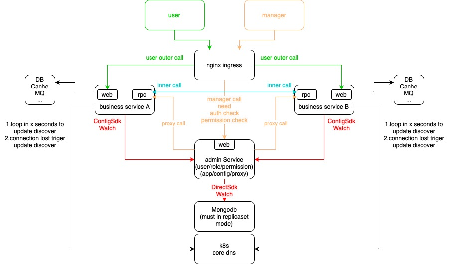

# Corelib

# Use
	1.install golang(1.18+)
	2.install git
	3.install protoc
	4.install protoc-gen-go
	5.[download the codegen in release] or [clone this lib and go into the codegen dir and install it by go install]
	6.make sure the codegen's path is in the system's or user's PATH env
	7.codegen -d path -n projectname -p packagename
	(without -d or -d is empty the default:current dir will be used)
	(projectname format,character must in [a-z][0-9],first character must in [a-z])
	(packagename must end with projectname,default:projectname will be used as packagename,e.g. github.com/path_to_the_repo/projectname)
# Description
## codegen
	generate the base code,if you want to use this lib,this is the start
## web
	Web framework,this contains protobuf plugin to generate code from proto file
## cgrpc
	grpc framework,this contains protobuf plugin to generate code from proto file
## stream
	stream connection framework,use websocket's frame format,so this can support rawtcp and websocket at the same time on same port
## crpc
	a new rpc framework(20-30% fast then grpc),this contains protobuf plugin to generate code from proto file
## id
	snow flake
## log
	log and trace log
## pool
	sync.Pool for []byte and bufio.Reader and bufio.Writer
## container
	some useful struct
## superd
	fork child process to exec some other program,like supervisor
