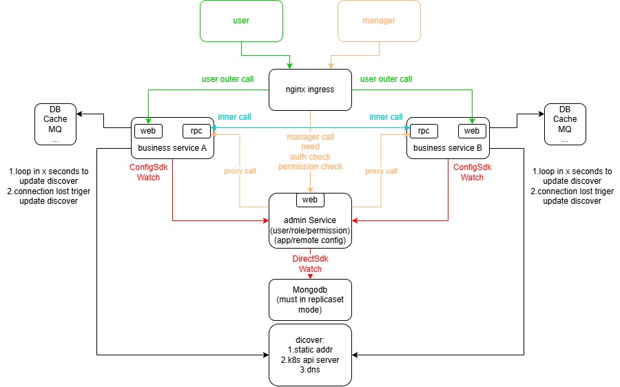

# Corelib

# Use
	1.install golang(1.24.1+)
	2.install git
	3.install protoc
	4.install protoc-gen-go
	5.[download the codegen in release] or [clone this repo and go into the codegen dir and install it by go install]
	6.make sure the codegen's path is in the system's or user's PATH env
	7.use this command to generate the base code:codegen -n projectname -p packagename
	(projectname format:character must in [a-z][0-9],first character must in [a-z])
	(packagename format:must end with projectname,default:projectname,e.g. github.com/path_to_the_repo/projectname)
# Description
## codegen
	generate the base code,if you want to use this lib,this is the start
## web
	Web framework contains trace and metrics function from opentelemetry,this also contains protobuf plugin to generate code from proto file
## cgrpc
	grpc framework contains trace and metrics function from opentelemetry,this also contains protobuf plugin to generate code from proto file
## crpc
	a new rpc framework contains trace and metrics function from opentelemetry,this also contains protobuf plugin to generate code from proto file
## pbex
    protobuf extension for message validate,this is used in the web/crpc/cgrpc framework
## stream
	stream connection framework,use websocket's frame format,so this can support rawtcp and websocket at the same time on same port
## ws
    a simple ws handshake and message recv and send framework
## container
	some useful struct
## mysql
    mysql driver wrapper with trace support and read write seprate
## mongo
    mongodb driver wrapper with trace support
## redis
    redis driver wrapper with trace support and some useful function(bloom filter,rate limiter,message queue,verify code check)
## email
    simple email client used to send email
## superd
	fork child process to exec some other program,like supervisor
